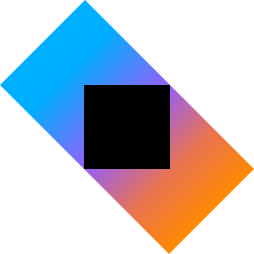

## Hi there 👋
I'm a freelance IT consultant working mainly with backend programing and IT/cloud infrastructure (so called DevOps), if you want to get in touch you can reach me on [LinkedIn](https://www.linkedin.com/in/alexanderrundberg/) or by [email](mailto:alex@gwai.se).

### Showcase
-   [Advent of Code 2024 in Go as microservices on Kubernetes](https://github.com/terminalnode/adventofcode2024)
-   [Advent of Code 2021 in Kotlin as a Ktor web API](https://github.com/terminalnode/adventofcode2021)
